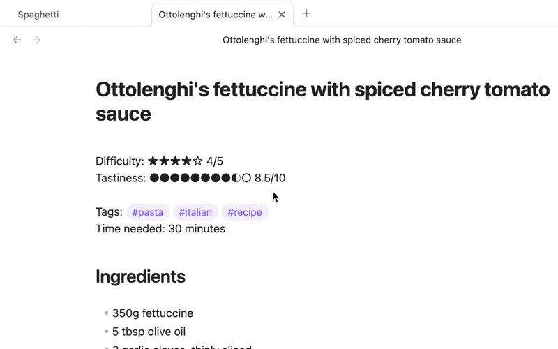

# Interactive Ratings Plugin for Obsidian

Add interactive rating symbols to your notes that update with a click.

## Usage

Type any supported symbol sequence (minimum 3 identical symbols) in your note. When you hover over these symbols in edit mode, clicking on one of the symbols allowing you to update the rating.

## Installation

1. In Obsidian settings, go to Community Plugins
2. Disable Safe Mode
3. Search for "Interactive Ratings"
4. Install and enable the plugin

### Rating Text (optional)

Add numerical ratings with these formats:

- `★★★☆☆` - Only symbols, no rating text
- `★★★☆☆ 3/5` - Fraction without parentheses
- `★★★☆☆ (3/5)` - Fraction in parentheses
- `★★★☆☆ 60%` - Percentage
- `★★★☆☆ (60%)` - Percentage in parentheses

The numerical rating updates automatically when you change the symbols.

## Supported Symbol Sets

| Symbol Type | Full | Empty | Half | Examples |
|-------------|------|-------|------|----------|
| Stars | ★ | ☆ |  | `★★★☆☆ (3/5)` Book rating |
| Star Symbols | ✦ | ✧ |  | `✦✦✦✧✧ (3/5)` Stargazing |
| Moon Phases | 🌕 | 🌑 | 🌗 | `🌕🌕🌗🌑🌑 (2.5/5)` Lunar observation |
| Circles | ● | ○ | ◐ | `●●●○○○○○○○ 3/10` Movie review scale |
| Squares | ■ | □ | ◧ | `■■■□ (3/4)` Recipe difficulty |
| Triangles | ▲ | △ |  | `▲▲▲▲▲△△△△△△△ 5/12` Hiking difficulty |
| Block Progress | █ | ▁ |  | `███▁▁▁ (3/6)` Project completion |
| Braille Dots | ⣿ | ⣀ | ⡇ | `⣿⣿⡇⣀⣀⣀⣀⣀⣀⣀ 2.5/10` |
| Solid/Empty Circles | ⬤ | ○ |  | `⬤⬤⬤○○○○○○○○○ 25%` Budget spending |
| Solid/Empty Squares | ■ | □ | | `■■■□□□□ 3/7` Weekly progress |
| Dotted Squares | ▰ | ▱ | | `▰▰▰▱▱▱▱▱▱▱ (3/10)` Task complexity |
| Filled/Empty Rectangles | ◼ | ▭ | | `◼◼◼▭ 75%` Reading progress |
| Vertical Bars | ▮ | ▯ | | `▮▮▮▮▮▮▯▯▯▯▯▯ 50%` Battery level |
| Bold Circles | ⬤ | ◯ | | `⬤◯◯ 1/3` Quick product review |
| Black/White Circles | ⚫ | ⚪ | | `⚫⚫⚫⚫⚫⚪⚪⚪⚪⚪ (5/10)` Coffee strength |
| Block/Light Shade | █ | ░ | | `███░░░░░░░ 30%` Download progress |

## Use Cases

- **Book/Media Reviews**: `★★★★☆☆☆☆☆☆ Just okay, 4/10`
- **Habit Tracking**: `Exercise: ●●●○○○○ (3/7) days this week`
- **Project Status**: `Client project: ████████░░ 80% complete`
- **Recipe Notes**: `Pasta recipe: ■■■□ (3/4) difficulty, would make again`
- **Learning Progress**: `Spanish vocabulary: ⬤⬤⬤⬤⬤⬤◯◯◯◯ 60% mastered`

## Support

For issues or feature requests: [GitHub repository](https://github.com/peritus/obsidian-interactive-ratings)

## License

MIT